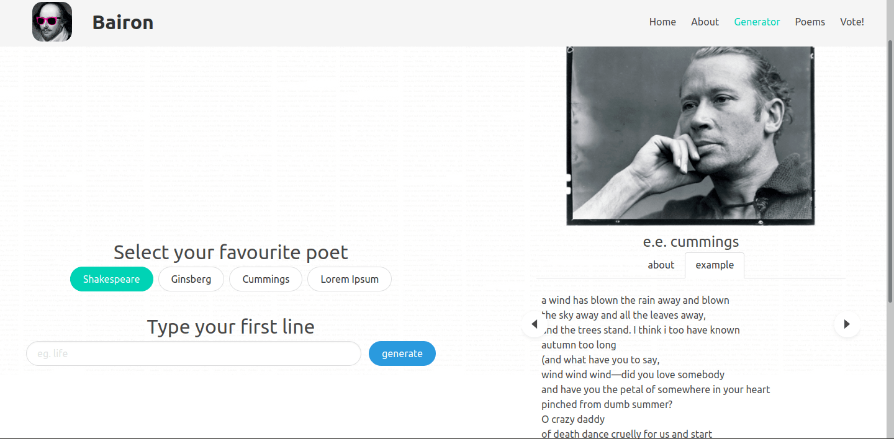
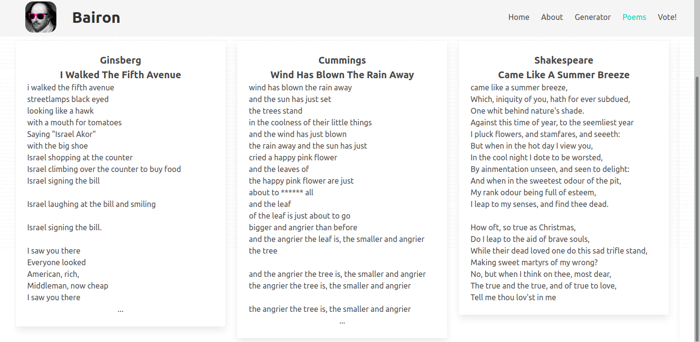
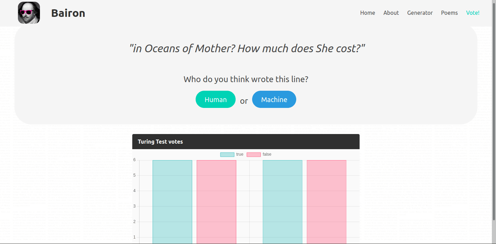

# Bairon

Generator:



Saved poems:



Poetry Turing Test:




## NLP

Dotrenowane modele:
- [x] William Shakespeare
- [x] Allen Ginsberg
- [x] e.e. cummings

Styl `Lorem Ipsum` dodałem tylko tymczasowo, do testowania, żeby nie trzeba było za każdym razem czekać na response po 20s.

## frontend

Frontend napisany w Vue.js

Style zrobione z pomocą Bulmy

Na razie działa to jako osobna aplikacja, docelowo zrobimy tak, że Django będzie serwowało spreparowaną aplikację

Podstrony:
- [x] Home - strona główna (`/`) 
- [x] Generate - strona do generowania i zapisywania wygenerowanych wierszy (`/generate`)
- [x] About - opis projektu, można zamiast prezentacji wykorzystać (`/about`)
- [x] Poems - lista wszystkich wygenerowanych wierszy, można filtrować(`/poems`)
- [x] Poem - wybrany wiersz, pokazuje statystyki i umożliwia głosowanie (`/poem/id`)
- [x] Turing Test - umożliwia głosowanie w TT (`/turing-test`)

## backend

### model bazy danych

#### Input:
- style - styl tekstu w jaki ma być wygenerowany z dostępnej listy
- first_line - pierwsza linia tekstu na podstawie której ma być generowany tekst
- ```TODO``` nie wiem czy będą jeszcze inne dane wejściowe

#### Poem:
- author - autor tekstu - Różni się od style, bo tu może być prawdziwy autor albo maszyna, jeśli jest wygenerowany przez AI
- input - FK do `Input` (opcjonalne, np. kiedy tekst jest prawdziwy)
- text - wygenerowany tekst
- views - ilość wyświetleń  (opcjonalne, automatycznie 0)
- sentiment - zaklasyfikowany sentyment  (opcjonalne, np. jak nie uda się tego zaimplementować)

#### Rate:
- poem - FK do `Poem`
- rating - liczba naturalna

#### TuringTestVote:
- poem - FK do `Poem`
- fragment - fragment tekstu na podstawie którego została podjęta decyzja (opcjonalne, np. jak nie będzie to potrzebne nigdzie)
- vote - Human/Machine

## API

`/api/generate/`

po wysłaniu jsona z danymi potrzebnymi do stworzenia `Input` zwraca jsona z wygenerowanym `Poem`

`/api/save/`

po wysłaniu jsona z danymi potrzebnymi do stworzenia `Poem` zapisuje się w bazie

`/api/poem/id/`

zwraca jsona z danymi wiersza o konkretnym id

`/api/poems/`

zwraca podstawowe (pierwsza linia i tekst) dane o [10] najczęściej wyświetlanych wierszach

`/api/poems/[style=style][&][sentiment=sentiment]`

zwraca podstawowe (pierwsza linia i tekst) dane o [10] najczęściej wyświetlanych wierszach od konkretnego autore i/lub z konkretnym sentymentem

`/api/rating/id/`

zwraca jsona z ocenami (zarówno średnia i TT) o wierszu z konkretnym id

`/api/rating/`

zwraca jsona z ocenami (zarówno średnia i TT) o wszystkich wierszach

`/api/add/rate/id/`

endpoint do dodawania z oceny [1-10] dla wiersza z konkretnym id

`/api/add/turing-test-vote/id/` 

endpoint do dodawania opinii Human/Machine dla wiersza z konkretnym id

`/api/get/tt-fragment/` 

endpoint odpytywania serwera o dane potrzebne do TT

## Uruchomienie

### model

Jak na razie działa tylko z python3.7 i niższym, z powodu starej wersji tensorflow.

Do przełączenia się między wersjami polecam pyenv.

### frontend

##### wer. alfa

1. `cd frontend`
2. `sudo npm install vue`
3. `sudo npm install -g @vue/cli`
3. `npm install`
4. `npm run serve`

### Django

Pobieranie modułów do pythona: `pip install -r requirements.txt`

Migracje: `python manage.py makemigrations` i `python manage.py migrate`

Żeby dodać admina automatycznie `python manage.py create_admin`, nie trzeba wtedy wszystkiego wpisywać - tworzy się automatycznie - login: `admin`, password: `admin`

Żeby załadować wiersze prawdziwych poetów do bazy (potrzebne do TT) `python manage.py save_poems`

Uruchomienie `python manage.py runserver`
